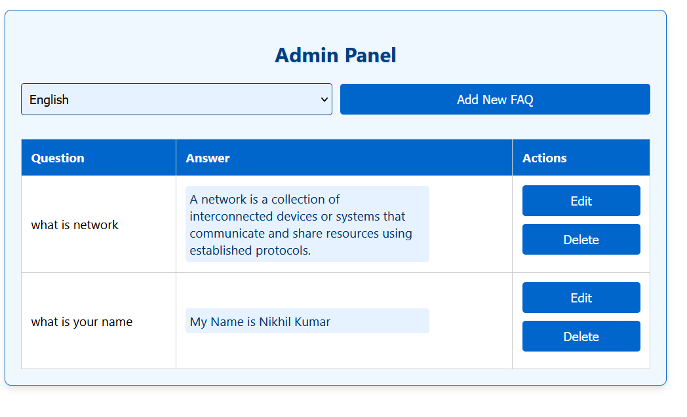
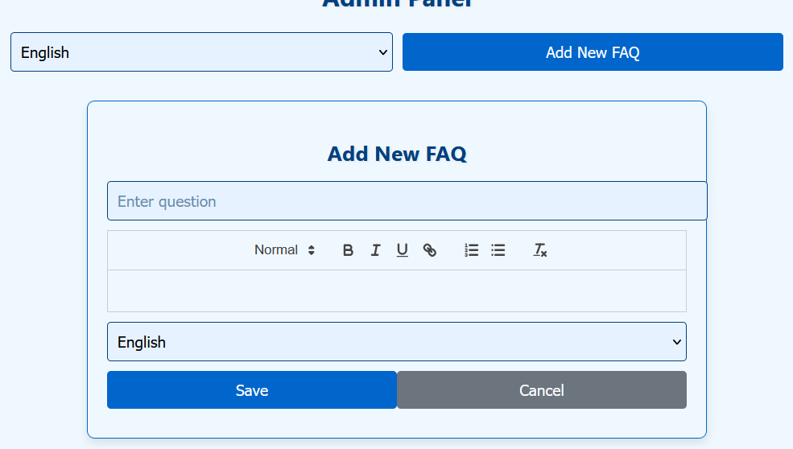
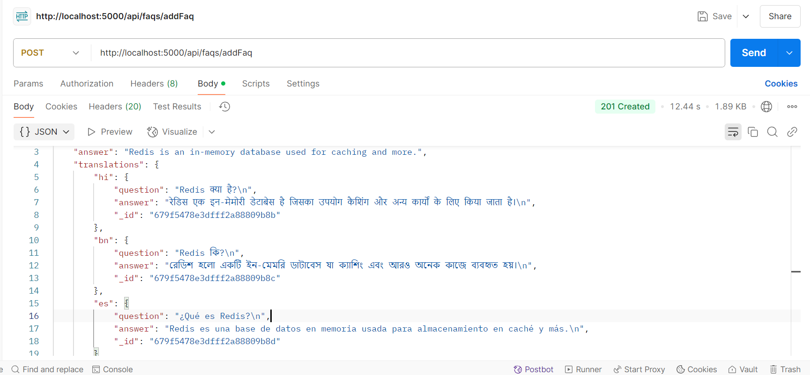

# FAQ Management API

## Overview
This project is a **FAQ Management System** designed with **Express.js**, **MongoDB (Atlas)**, **Redis Cloud**, and **Google Translate API**. It enables **multilingual FAQs** with caching and a user-friendly WYSIWYG editor for managing FAQ content.

## Features
- **RESTful API** for FAQ handling
- **Supports multiple languages** via Google Translate API
- **Optimized caching with Redis** for better performance
- **Rich text editing** using Quill.js on the frontend
- **Security measures** using Helmet.js and CORS
- **Unit Testing** with Jest framework
- **Health Check API** to monitor the system

---

## Technology Stack
### Backend:
- **Node.js & Express.js** - API framework
- **MongoDB Atlas** - Database storage
- **Redis Cloud** - Caching for faster response
- **Google Translate API** - Automated translations

### Frontend:
- **React.js** - User interface
- **Redux** - State management
- **Quill.js** - Rich text editor

---

## Setup & Installation

### Prerequisites
- Node.js (v18+)
- MongoDB Atlas account
- Redis Cloud account
- Google Cloud API Key (for Google Translate API)
- Docker (Optional for containerized deployment)

### Clone the Repository
```sh
 git clone https://github.com/kumar102003/Bharat_Fd_Assignment.git
 cd server
```

### Configuration
Create a `.env` file in the root directory with the following details:
```env
PORT=5000
MONGO_PASS=<your_mongo_password>
REDIS_PASS=<your_redis_password>
REDIS_HOST=<your_redis_host>
REDIS_PORT=<your_redis_port>
GOOGLE_TRANSLATE_API_KEY=<your_google_translate_api_key>
```

### Install Dependencies
```sh
npm install
```

### Run the Server
#### Without Docker
```sh
nodemon server.js
```

---

## API Documentation

### Base URL
```
http://localhost:5000/api/faqs
```

### Available Endpoints
| Method | Endpoint            | Description         |
|--------|--------------------|-------------------|
| GET    | `/getFaq`           | Retrieve all FAQs |
| POST   | `/addFaq`           | Create a new FAQ  |
| PUT    | `/updateFaq/:faqId` | Modify an FAQ     |
| DELETE | `/deleteFaq/:faqId` | Remove an FAQ     |

---

### 1️⃣ Fetch FAQs
```http
GET /api/faqs/getFaq?lang=<language_code>
```
#### Example: Retrieve FAQs in Hindi
```sh
curl http://localhost:5000/api/faqs/getFaq?lang=hi
```

---

### 2️⃣ Create a New FAQ
```http
POST /api/faqs/addFaq
```
#### **Request Body (JSON)**
```json
{
  "question": "What is Node.js?",
  "answer": "Node.js is a JavaScript runtime built on Chrome's V8 engine."
}
```

---

### 3️⃣ Modify an Existing FAQ
```http
PUT /api/faqs/updateFaq/:faqId
```

---

### 4️⃣ Remove an FAQ
```http
DELETE /api/faqs/deleteFaq/:faqId
```

---

### 5️⃣ Health Check Endpoint
```http
GET /health
```
#### Response:
```html
<h1>Everything is Running Smoothly!</h1>
```

---

## Caching with Redis
The system **leverages Redis** to cache FAQs and translations, significantly reducing response times and minimizing repeated API calls.

---

## Deployment
This project can be deployed using **Vercel**, Docker, or any cloud provider.  

- **Frontend Hosted on**: [Live UI](https://faq-client.vercel.app/)  
- **Backend API Running at**: [Live API](https://faq-backend-api.vercel.app/)  

---

## Frontend Preview

Here’s how the frontend interface looks:

### **Admin Dashboard**


### **FAQ Editor**


### **Postman**


---

## Contact
For queries, feel free to reach out at **nikhil46269@gmail.com**.

🚀 **Happy Coding!**

